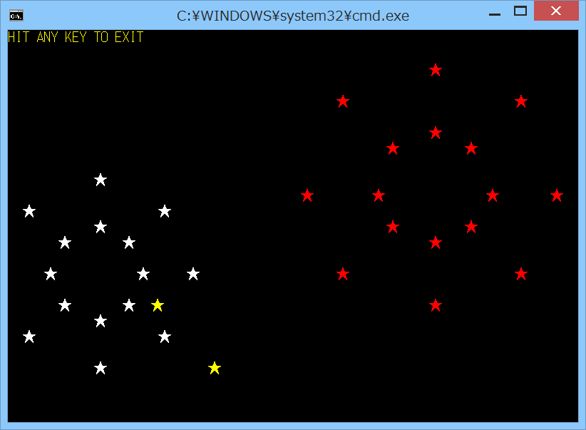

# mscon



## 概要
- Windows のコマンドプロンプトで Gauche(gosh.exe) を使うときに、  
  コンソールの制御を可能とするモジュールです。


## インストール方法
- mscon.scm を Gauche でロード可能なフォルダにコピーします。  
  (例えば (gauche-site-library-directory) で表示されるフォルダ等)


## 使い方
```
  (use mscon)                  ; モジュールをロードします
  (cls)                        ; 画面をクリアします(コマンドのため遅い)
  (cls2)                       ; 画面をクリアします2(*)
  (screen-left)                ; 画面の左上のx座標を取得します(単位:文字)
  (screen-top)                 ; 画面の左上のy座標を取得します(単位:文字)
  (screen-width)               ; 画面の幅を取得します(単位:文字)
  (screen-height)              ; 画面の高さを取得します(単位:文字)
  (cursor-x)                   ; カーソルのx座標を取得します(単位:文字)
  (cursor-y)                   ; カーソルのy座標を取得します(単位:文字)
  (cursor-off)                 ; カーソルを非表示にします
  (cursor-on)                  ; カーソルを表示します
  (locate 10 10)               ; カーソルを座標(x,y)に移動します(単位:文字)
  (color COL_GREEN)            ; 色を設定します
  (print "HIT ANY KEY!")       ;
  (keywait)                    ; キーボードの入力を待ちます
  (keystate)                   ; キーボードの状態を取得します(*)
  (keystate-test)              ; キーボード状態取得テスト用です(*)
  (keywait2 3000)              ; キーボードの入力を待ちます2(タイムアウト設定可能(msec))(*)
  (keyclear)                   ; キーボードの入力をクリアします(*)
  (puttext "ABCDE" 10 10)      ; 座標(x,y)に文字列を表示します
  (putcolor 5 10 10 COL_GREEN) ; 座標(x,y)からn文字分に色を設定します(*)

  (*)マークがある命令は Gauche v0.9.3.3 では使用できません。
     使用可能かどうかは (mscon-all-available?) でチェックできます。
```

## 注意事項
1. writeやdisplayが、指定したカーソル位置に表示しない。  
   → flush すれば表示される。

2. 最下行にprintで表示すると、改行のためスクロールしてしまう。

3. puttextが、colorで指定した色では表示しない。  
   (色をつけるにはputcolorと併用する必要がある)

4. リダイレクトには非対応(エラーになる)。

5. Windows 8上のGauche v0.9.3.3では、しばらく動いた後に実行時エラーが出る(原因不明)。


## 環境等
- OS
 - Windows XP Home SP3
 - Windows 8 (64bit)
- 言語
 - Gauche v0.9.4
 - Gauche v0.9.3.3  

## 履歴
- 2014-6-22 v1.00 (初版)
- 2014-6-22 v1.01 コメント修正のみ
- 2014-6-23 v1.02 コメント修正のみ
- 2014-6-23 v1.03 keywait2の処理を修正
- 2014-6-23 v1.04 cls2の処理を修正  
  (sys-fill-console-output-characterの引数型変更(文字列→文字))
- 2014-6-24 v1.05 コメント修正のみ
- 2014-6-24 v1.06 keystate-testの処理を一部見直し
- 2014-6-25 v1.07 keywait2の処理を修正
- 2014-7-21 v1.08 コマンド追加(screen-left,screen-top,cursor-x,cursor-y)  
  一部処理見直し
- 2014-7-22 v1.09 keystateの処理を一部見直し


(2014-7-22)
